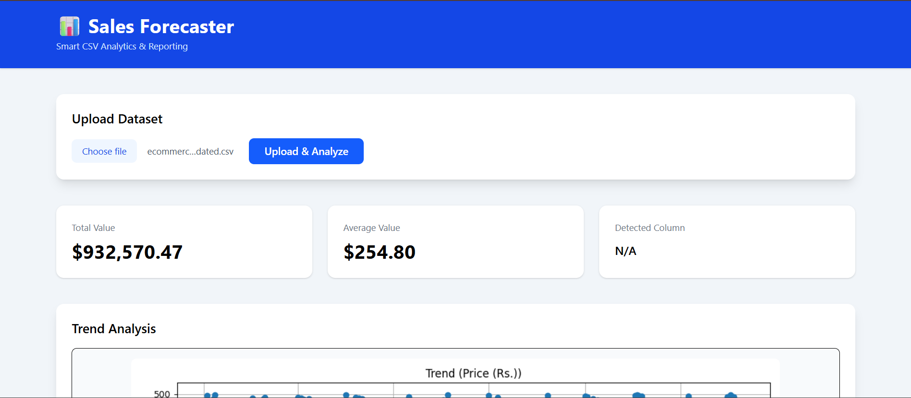
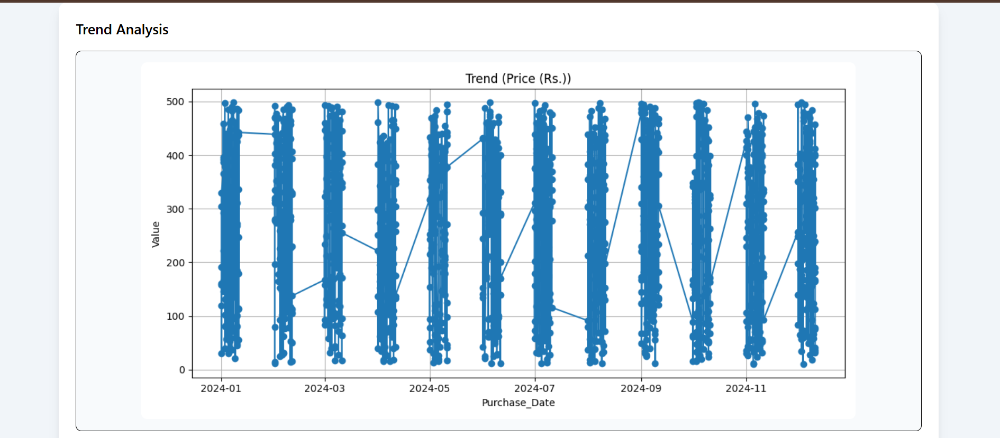
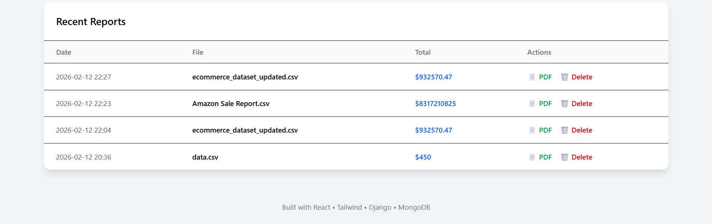

# 📊 Sales Forecaster

A full-stack analytics platform that allows users to upload CSV files, analyze sales data, visualize trends, and download reports as PDF.

## 🚀 Features

- CSV Upload & Smart Data Detection
- Automatic Numeric Column Identification
- Automatic Date Column Detection
- Interactive Sales Trend Chart
- PDF Report Generation & Download
- Report History Management
- Delete Previous Reports
- Upload Progress Bar
- Responsive Dashboard UI


## 🛠 Tech Stack

### Frontend
- React (Vite)
- Tailwind CSS

### Backend
- Django
- Django REST Framework
- JWT Authentication
- MongoDB
- Matplotlib
- ReportLab

## 📸 Screenshots





## ⚙️ Installation

### Backend

```bash
cd backend
pip install -r requirements.txt
python manage.py migrate
python manage.py runserver
Frontend
cd frontend
npm install
npm run dev
👨‍💻 Author
Soumyaranjan Pradhan
MCA Student | Full Stack Developer
